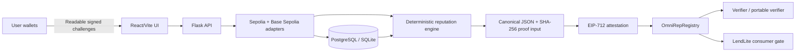

<div align="center">

# 🪪 OmniRep

### The omnichain reputation passport for the on-chain world

[](https://github.com/Sanjeevakumarnani/OmniRep-PS64-INNOBLOCK)
[](https://github.com/Sanjeevakumarnani/OmniRep-PS64-INNOBLOCK)
[](LICENSE)
[](contracts/)
[](backend/)

**[🚀 Try the live demo](https://omni-rep-ps-64-innoblock.vercel.app)** · **[📐 Architecture](docs/ARCHITECTURE.md)** · **[🧮 Scoring model](docs/SCORING.md)** · **[🔐 Security](SECURITY.md)**

</div>

---

## The 60-second idea

A user's reputation is often scattered across multiple wallets and chains. OmniRep turns that fragmented history into a **portable, explainable, and verifiable reputation passport**.

1. **Link wallets** by signing readable, expiring challenges—without transferring assets.
2. **Collect evidence** from Ethereum Sepolia and Base Sepolia.
3. **Calculate a deterministic score** with visible reasons, confidence, and Sybil-risk signals.
4. **Publish a compact on-chain proof** that other applications can verify.
5. **Use the proof** in a consumer application such as the included `LendLite` gate.

> OmniRep is designed to make reputation useful without making users trust a black-box score or a single wallet address.

## Why OmniRep stands out

| Differentiator | What it means in practice |
| --- | --- |
| **Passport-centric identity** | A person can prove control of multiple wallets while keeping the passport as the primary identity. |
| **Explainable by design** | The score is deterministic, versioned, and broken down into understandable factors. |
| **Cross-chain from day one** | Evidence can be collected across Ethereum Sepolia and Base Sepolia. |
| **Privacy-aware trust boundary** | Detailed activity stays off-chain; the chain stores compact commitments and verification signals. |
| **Verifiable, not just visual** | SHA-256 proof inputs and EIP-712 attestations let consumers verify what was published. |
| **Useful beyond the demo** | `LendLite` demonstrates how a dApp can gate access from the registry signal. |

## Product capabilities

- 🔗 **Multi-wallet linking** with nonce, expiry, and signature verification.
- 🌐 **Cross-chain indexing** for Ethereum Sepolia and Base Sepolia activity.
- 📊 **0–1000 deterministic reputation score** with versioned scoring logic.
- 🛡️ **Sybil Radar** with deterministic indicators and an optional AI second opinion.
- 🧾 **On-chain registry** containing score, tier, risk, metadata, timestamps, and proof commitments.
- ✅ **Browser-side proof verification** with a tamper mode that demonstrates mismatch detection.
- 🏦 **LendLite consumer gate** that reads the published registry signal directly.
- 🌉 **Portable Base attestation path** for verification without moving the detailed record on-chain.
- 🧪 **Playground contracts** for creating reproducible testnet loan, repayment, governance, and contribution events.

## Hackathon demo flow

Use this order for a clear judge-friendly walkthrough:

1. Open the live app and create a passport with a burner wallet on Ethereum Sepolia.
2. Link a second burner wallet on Base Sepolia by signing the challenge.
3. Use **Playground** to create a testnet loan/repayment, vote, or contribution event.
4. Press **Refresh evidence** to normalize activity from both chains.
5. Open **Passport overview** and show the score breakdown, evidence, confidence, and recent links.
6. Open **Sybil Radar** to explain risk indicators and the optional AI second opinion.
7. Open **Publish** and sign the EIP-712 attestation. The passport owner submits the publication transaction.
8. Open **Verifier**, recompute the proof, then enable tamper mode to show a deliberate mismatch.
9. Open **LendLite Gate** and show access being granted or blocked from the on-chain signal.
10. If time permits, demonstrate the portable Base verification path.

## How the system works



### What stays off-chain vs. on-chain

| Off-chain | On-chain |
| --- | --- |
| Linked wallet details and signatures | Final score and tier |
| Normalized activity and evidence | Sybil-risk signal |
| Score breakdown and explanations | Model/version metadata |
| Sybil features and optional AI explanation | SHA-256 proof-input hash |
| Detailed proof bundle | Linked-wallet-set commitment, linked count, and timestamp |

This boundary keeps the ledger compact while preserving a verifiable fingerprint of the detailed record.

## Transparent scoring

The final score is **0–1000** and uses the versioned model `20001` (`omnirep_scoring_v2`).

| Factor | Maximum | Measures |
| --- | ---: | --- |
| Repayments | 220 | On-time and late repayment outcomes |
| Wallet longevity | 170 | Earliest observed history and active weeks |
| Activity quality | 130 | Indexed transactions and successful interactions |
| Consistency | 120 | Distribution of activity across days and weeks |
| Cross-chain breadth | 110 | Activity across independent chains |
| Governance | 90 | Distinct governance proposals voted on |
| Contributions | 90 | Recorded contribution signals |
| Counterparty diversity | 70 | Distinct interaction counterparties |
| Outcome penalties | -200 | Defaults and other negative outcomes |

The raw total is adjusted by deterministic Sybil-risk and freshness multipliers, then clamped to 0–1000.

**Important:** reputation, confidence, and Sybil risk are different signals.

- **Reputation** measures the strength of observed behavior.
- **Confidence** measures how much trustworthy evidence is available.
- **Sybil risk** highlights suspicious patterns; it does not automatically label a new or sparse wallet as malicious.

### Reputation tiers

| Tier | Score |
| --- | ---: |
| 🪨 Iron | 0–199 |
| 🥉 Bronze | 200–399 |
| 🥈 Silver | 400–599 |
| 🥇 Gold | 600–799 |
| 💎 Diamond | 800–1000 |

## Repository map

```text
.
├── backend/                 # Flask API, wallet verification, indexer, scoring, proofs
├── contracts/               # Registry, verifier, evidence sources, LendLite, badge
├── deployments/             # Deployment outputs and network metadata
├── frontend/                # React + Vite application
├── sdk/                     # Minimal consumer integration helper
├── docs/
│   ├── ARCHITECTURE.md      # System design and trust model
│   └── SCORING.md           # Factors, tiers, confidence, and Sybil Radar
├── scripts/                 # Compile, deploy, and preflight scripts
├── test/                    # Contract tests
├── hardhat.config.js        # Hardhat network configuration
├── render.yaml              # Render deployment configuration
└── SECURITY.md              # Vulnerability reporting guidance
```

## Quickstart

### Prerequisites

- Node.js version specified by `.nvmrc`
- Python version specified by `.python-version`
- npm
- A funded **burner wallet** for public testnets only
- RPC endpoints for Ethereum Sepolia and Base Sepolia

### 1. Install dependencies

```bash
npm install
npm --prefix frontend install

cd backend
python -m venv .venv
source .venv/bin/activate       # Windows PowerShell: .venv\\Scripts\\Activate.ps1
pip install -r requirements.txt
cd ..
```

### 2. Configure environment variables

Copy the examples and fill them with testnet-only credentials:

```bash
cp .env.example .env
cp backend/.env.example backend/.env
cp frontend/.env.example frontend/.env.local
```

Never commit private keys, database credentials, attestor keys, or API secrets. Use a fresh burner wallet and public testnets.

### 3. Compile and test contracts

```bash
npm run contracts:compile
npm run contracts:test
```

### 4. Deploy contracts

Configure the deployer key and Sepolia RPC URL in `.env`, then run:

```bash
npm run contracts:deploy
npm run contracts:deploy:base
```

The deployment scripts print the addresses needed by the backend and frontend.

### 5. Run the backend and frontend

Terminal 1:

```bash
cd backend
source .venv/bin/activate
python app.py
```

Terminal 2:

```bash
npm run frontend:dev
```

For a production frontend build:

```bash
npm run frontend:build
```

## Useful commands

| Command | Purpose |
| --- | --- |
| `npm run frontend:dev` | Start the Vite frontend |
| `npm run frontend:build` | Type-check and build the frontend |
| `npm run contracts:compile` | Compile Solidity contracts |
| `npm run contracts:test` | Run Hardhat contract tests |
| `npm run contracts:deploy` | Deploy to Ethereum Sepolia |
| `npm run contracts:deploy:base` | Deploy the Base Sepolia path |
| `npm run deployment:preflight` | Validate deployment prerequisites |

## Integration example

A consumer can gate a feature with one registry read through the SDK interface:

```solidity
interface IPassportGate {
    function meets(
        uint256 passportId,
        uint16 minScore,
        uint64 maxAge
    ) external view returns (bool);
}
```

See [`sdk/README.md`](sdk/README.md) for the minimal consumer helper.

## Deployment and demo boundaries

OmniRep is structured for deployment, but a responsible demo must distinguish implemented code from environment-dependent infrastructure:

- The included flow targets public testnets, not production funds.
- A live deployment requires funded burner wallets, RPC endpoints, explorer/API credentials, and configured environment variables.
- PostgreSQL via Neon or Supabase is recommended for persistent deployment; local SQLite is useful for development.
- Frontend deployment can use Vercel; `render.yaml` contains backend deployment configuration.
- Contract addresses and transaction links should only be added after a real deployment has been completed and verified.

## Security and privacy

- Wallet signatures prove control; the application never needs users' private keys.
- Linked wallet details and detailed evidence remain off-chain by design.
- The chain stores commitments and compact verification signals rather than the full activity record.
- Deterministic scoring is the source of truth; optional AI is only a bounded second opinion.
- Use burner wallets and public testnets for demonstrations.
- Please report vulnerabilities according to [`SECURITY.md`](SECURITY.md).

## Documentation

- [`docs/ARCHITECTURE.md`](docs/ARCHITECTURE.md) — architecture, data boundary, and trust model
- [`docs/SCORING.md`](docs/SCORING.md) — score factors, tiers, confidence, and Sybil Radar
- [`sdk/README.md`](sdk/README.md) — consumer integration helper
- [`SECURITY.md`](SECURITY.md) — security reporting

## Built for INNOBLOCK 2.0

OmniRep was built for the **INNOBLOCK 2.0 · PS64 · Domain 7: Digital Identity** challenge. The project focuses on making decentralized identity more useful, understandable, and verifiable across chains.

## License

Released under the [MIT License](LICENSE).
